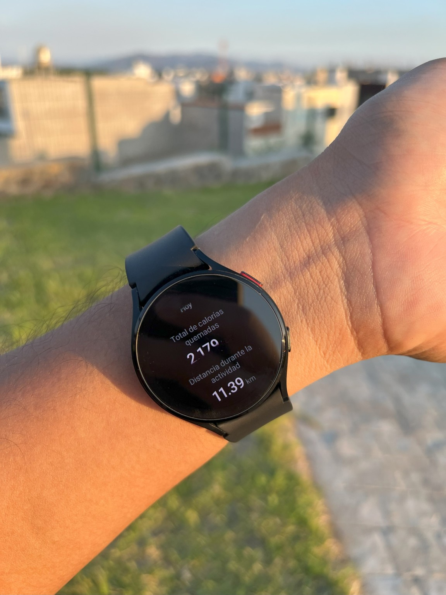
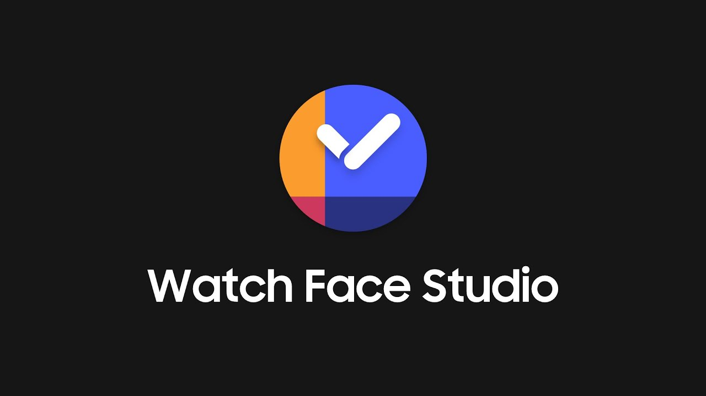
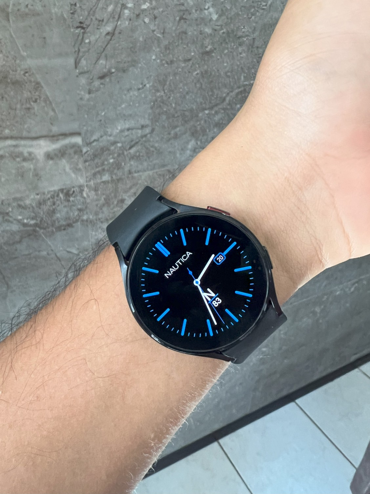
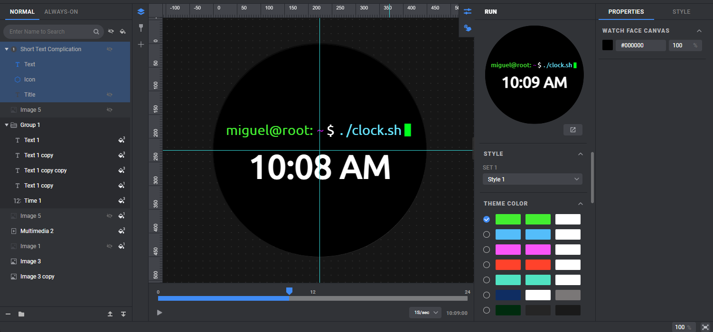
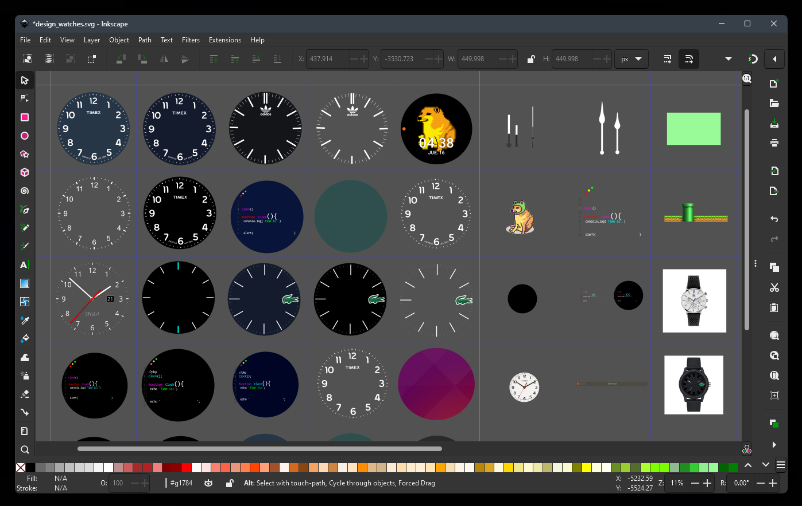

# Design Watch

Wear Os

## Requirements

    
    
    
    
    
    

## Project Usage

This project has been developed for educational and learning purposes. It is not intended for commercial use or distribution. It is provided as a resource to enhance skills and knowledge.

If you choose to use this project, please note that there is no guarantee regarding its functionality or performance.

## About

    <table align="center">
        <tr border="none">
            <td width="40%" align="center">
                
                </td>
                <td width="50%" align="center" style="text-align: justify;">
                  Samsung Watch Studio is a tool that allows developers and designers to create custom watch faces for Samsung smartwatches, such as the Galaxy Watch. With this platform, you can design attractive and functional interfaces without advanced programming knowledge. It offers a wide range of customization options, including animations, health indicators, widgets, and more, enabling users to create unique experiences tailored to their needs. It's ideal for both developers looking to build advanced watch faces and designers aiming to add a personal touch to their devices.
                  

                       
                      
                  

            </td>
        </tr>
    </table>

    <table align="center">
        <tr border="none">
            <td width="50%" align="center" style="text-align: justify;">
                    Inkscape was used to design the watch dials in SVG format, allowing for high customization and graphic quality in watch faces. This approach facilitates the creation of detailed and scalable designs, which are then integrated into the development of watch faces using specialized tools. With the ability to add animations, health indicators, and interactive widgets, designers can create unique and visually appealing experiences for smart devices.
                    

                         
                        
                    

                </td>
                <td width="40%" align="center">
                
            </td>
        </tr>
    </table>

 

## Desing

My Design Watch 4 in Android designed in inkscape, creating vector layouts

  

 
    
<b>Make with 🎸, 🍺, ☕ by Miguel Fletes</b>

